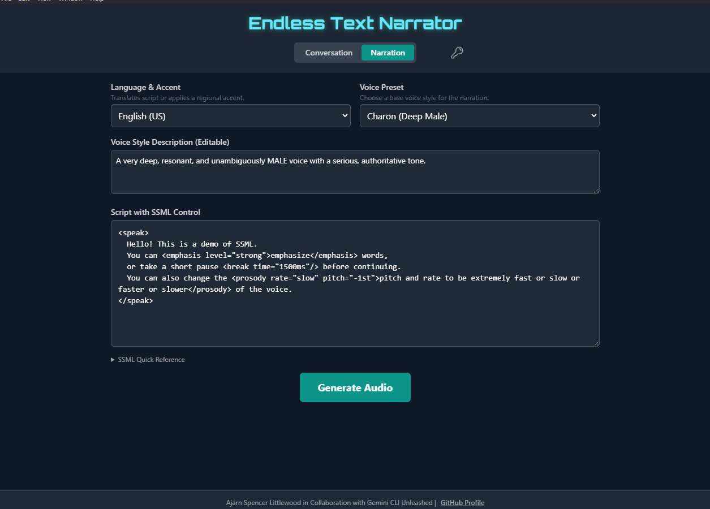

<div align="center">

# Endless Text Narrator

## An advanced text-to-speech narrator and real-time conversational AI application built with React, TypeScript, Electron, and the Google Gemini API.

### This application allows for the creation of long-form audio narrations from text with SSML support, voice style customization, and multi-language translation. It also features a real-time voice conversation mode with live transcription.
</div>


  
<div align="left">

## Features

-   **Narration Mode**: Convert large blocks of text into a single, downloadable `.wav` audio file, perfect for long-form content.
-   **SSML Support**: Fine-tune audio output with Speech Synthesis Markup Language (`<break>`, `<emphasis>`, `<prosody>`) for professional-grade narration.
-   **Multi-Language & Accents**: Narrate and translate text into dozens of languages. It also supports regional accents like UK and Indian English.
-   **Custom Voice Styles**: Use pre-built, high-quality voices or analyze a recording of your own voice to create a unique AI speaking style.
-   **Conversation Mode**: Engage in real-time, low-latency voice conversations with a Gemini-powered AI.
-   **Live Transcription**: See a live transcript of the conversation as you speak with the AI.
-   **Cross-Platform Desktop App**: Packaged with Electron for a native experience on Windows, macOS, and Linux.

## Screenshots:
</div>
<div align="left">


</div>
<div align="left">

## Prerequisites

To run this application, you will need a **Google Gemini API Key**. The application's features rely on the Gemini API for all AI-powered functionality.

-   You can obtain a free API key from [Google AI Studio](https://aistudio.google.com/app/apikey).
-   Note that the free tier has usage limits. For more extensive use, you may need to set up billing on a Google Cloud project.

## Installation & Setup

You can download the latest release for your operating system from the [Releases page](https://github.com/AjarnSpencer/endless-text-narrator/releases).

Once installed, the application will prompt you to enter your Google Gemini API Key on the first launch. This key is stored securely in your browser's local storage and is not transmitted anywhere else.

## How to Run Locally (for Development)

1.  **Clone the repository:**
    ```bash
    git clone https://github.com/AjarnSpencer/endless-text-narrator.git
    cd endless-text-narrator
    ```

2.  **Install dependencies:**
    ```bash
    npm install
    ```

3.  **Run the React development server:**
    ```bash
    npm run dev
    ```

4.  **In a separate terminal, run the Electron app:**
    ```bash
    npm run electron:start
    ```
    This will open a native desktop window with the application running and connected to the development server, with hot-reloading enabled.

## How to Build Executables

To compile the application into installers for Windows, macOS, and Linux, run the following command:

```bash
npm run electron:package
```

The process will first build the React application for production, then package it using `electron-builder`. The final executables and installers will be located in the `/release` directory.

## Contributing

Contributions are welcome! Please read our [Contributing Guidelines](CONTRIBUTING.md) to get started. Also, please review our [Code of Conduct](CODE_OF_CONDUCT.md).

## License

This project is licensed under the Apache 2.0 License - see the [LICENSE](LICENSE) file for details.


  <h1>Built with AI Studio</h2>

  <p>The fastest path from prompt to production with Gemini.</p>

  <a href="https://aistudio.google.com/apps">Start building</a>
[Build & Release Desktop App](https://github.com/AjarnSpencer/endless-text-narrator/actions/workflows/build-and-release.yml)

[License: Apache 2.0](https://opensource.org/licenses/Apache-2.0)
</div>
